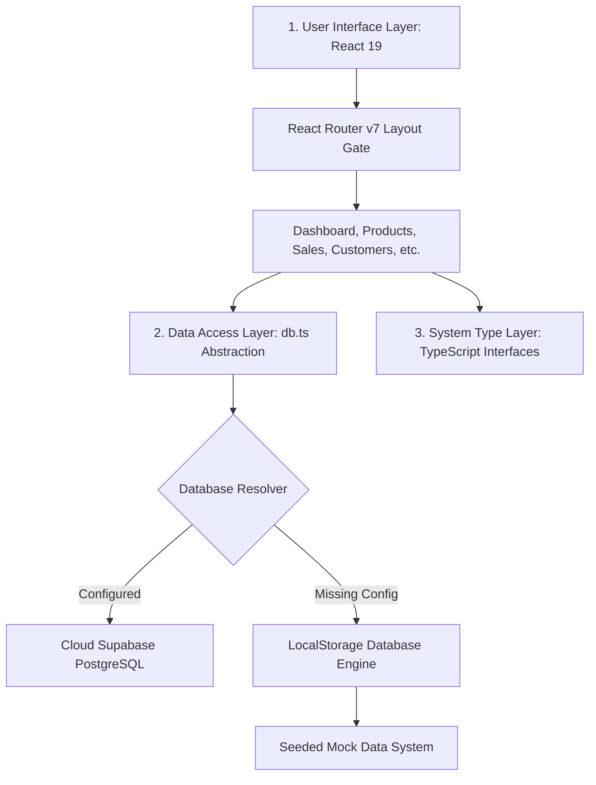
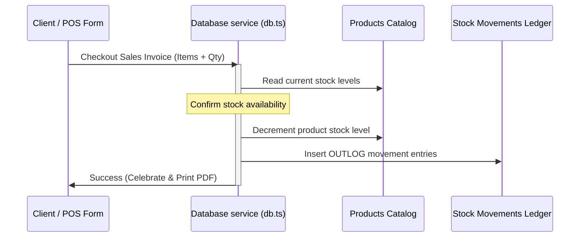

# Software Architecture Documentation

This document explains the software design, directory structures, database abstract layer, and transaction workflows of the **Code Bondhu IT ERP** system.

---

## 🏛️ System Overview

The ERP is designed with a **three-tier client-side architecture** focused on **offline-first resilience**, strictly typed interfaces, and secure privilege gates.



---

## 📁 Workspace Directory Structure

Below is the directory mapping of the codebase, detailing the purpose of each structural folder:

```
d:/jobs/Codebondhu/
├── public/                       # Static public assets
│   ├── logo.png                  # Code Bondhu IT Corporate Logo
│   ├── favicon.svg               # Web favicon
│   └── icons.svg                 # SVG sprite maps
├── src/
│   ├── assets/                   # Theme resources (CSS / local files)
│   ├── components/               # Shareable layouts & UI elements
│   │   └── layout/
│   │       ├── Layout.tsx        # Auth gateway container & routing outlet
│   │       ├── Navbar.tsx        # Left-aligned search, status dot & profile dropdown
│   │       └── Sidebar.tsx       # Sidebar logo, active NavLinks & session footer
│   ├── pages/                    # Domain specific page components
│   │   ├── Auth.tsx              # Glassmorphic Login & credential seed presets
│   │   ├── Dashboard.tsx         # Responsive executive metric cards & charts
│   │   ├── Products.tsx          # 3-column compact forms & view-only staff blocks
│   │   ├── Inventory.tsx         # Full-width tabbed Movements Ledger & Stock Alerts
│   │   ├── Purchases.tsx         # Purchase Orders logs & Admin CRUD controllers
│   │   ├── Sales.tsx             # Point of Sale Checkout & printable PDF invoices
│   │   ├── Customers.tsx         # Customers CRM database listing
│   │   ├── Suppliers.tsx         # Suppliers partner registry
│   │   └── Reports.tsx           # CSV export utility & tabular report filters
│   ├── services/                 # Database engines and abstract gateways
│   │   ├── db.ts                 # Resiliency engine resolving Cloud vs. Local DB
│   │   ├── mockData.ts           # Rich pre-seeded mockup dataset
│   │   └── supabaseClient.ts     # Supabase client initializer
│   ├── types/                    # System typings and schemas
│   │   └── index.ts              # Strictly declared TypeScript interfaces
│   ├── App.tsx                   # Routes mappings and QueryClient setup
│   ├── index.css                 # Typography importing, tailwind variables & scrollbars
│   └── main.tsx                  # Client DOM bootstrap point
```

---

## 💾 Data Access Layer (DAL) Architecture

A major highlight of this project is the **offline-first database resilience abstraction** located in `src/services/db.ts`. 

### Dual-Mode Database Abstraction
The system utilizes a repository pattern where each registry (Products, Customers, Suppliers, Purchases, Sales) implements an identical asynchronous interface. The data service automatically resolves database operations based on configuration parameters:

```typescript
export interface DBRepository<T> {
  list(): Promise<T[]>;
  create(data: Omit<T, 'id' | 'created_at'>): Promise<T>;
  update(id: string, data: Partial<T>): Promise<T>;
  delete(id: string): Promise<void>;
}
```

1. **Cloud Sync Mode**:
   If environment keys are active, queries route directly to the Supabase client, fetching live data using PostgREST queries over client-side HTTP hooks.
2. **Local Fallback Mode**:
   If cloud configurations are absent, the engine falls back to browser-level `LocalStorage` persistence. On initial load, the fallback system automatically seeds the cache from `src/services/mockData.ts` with a detailed business dataset to ensure a fully functional environment immediately.

---

## 🔄 Transactional Workflows & Stock Synchronization

Adding, modifying, or removing transactions (Purchases and Sales) triggers automated, transactional inventory calculations:



- **Stock Incrementation**: Registering a **Purchase Order** automatically increases product stock counts. Updating or deleting a historical PO dynamically recalculates inventory levels to match the new PO delta values.
- **Stock Decrementation & Safety Checks**: Executing a **Sales Checkout** decrements product stock. The checkout process verifies stock levels *before* executing. If inventory is insufficient, the transaction blocks and throws a visual stock notification.
- **Movements Ledger**: Every transactional delta logs an event entry to the `stock_movements` ledger as `INCOMING` or `OUTGOING`, compiling the complete history in the **Logistics** page.

---

## 🔒 Permission Gating & User Privileges

Security and write privileges are locked down based on account roles:

| Module / Action | Admin Profile | Staff Profile | UI Guard |
| :--- | :---: | :---: | :---: |
| **View Dashboard & Logs** | ✅ | ✅ | Rendered fully |
| **Search & CSV Exports** | ✅ | ✅ | Rendered fully |
| **POS Checkout / Create PO** | ✅ | ❌ | Hidden Button |
| **Add Product/Customer/Supplier** | ✅ | ❌ | Hidden Button |
| **Edit/Update Records** | ✅ | ❌ | Action cells replaced by "View Only" text |
| **Delete Historical Logs** | ✅ | ❌ | Action cells locked and hidden |

---

## 🛠️ Build Pipeline & Styling Tokens

### 1. Build Compilation
- Designed to package via **Vite 8** using standard ESM modules.
- Segmented type-checking (`npx tsc --noEmit`) from asset compiling (`npx vite build`) to lower runtime overhead.
- Optimized Node.js memory footprint using `--max-old-space-size=256` to pass build barriers in restricted virtualization environments.

### 2. Styling Tokens (TailwindCSS v4)
- Global fonts configured to use Google Fonts **Plus Jakarta Sans**.
- Uses customized utility HSL variables mapping borders, borders-focus, primary HSL variables, and dark-theme tokens to achieve high-end visual unity.

---

## 🚀 Setting Up the Database & Making It Live

Follow these steps to migrate from local storage fallback to a live cloud database backend:

### Step 1: Create a Supabase Project
1. Visit [Supabase Console](https://supabase.com) and sign in.
2. Click **New Project** and select your organization.
3. Configure your project name, database password, and region, then click **Create New Project**.

### Step 2: Migrate SQL Schema (`supabase_schema.sql`)
1. Open the [supabase_schema.sql](file:///d:/jobs/Codebondhu/supabase_schema.sql) file located at the root of the project workspace.
2. Copy the entire file content.
3. In your Supabase Dashboard, navigate to the **SQL Editor** tab from the left sidebar.
4. Click **New Query**, paste the copied SQL schema, and click **Run**.
5. This script automatically:
   - Configures the core tables (`products`, `customers`, `suppliers`, `purchases`, `sales`, `stock_movements`).
   - Seeds default Admin/Staff authentication user metadata profiles.
   - Attaches database triggers that automatically generate matching user accounts in the public profiles table when users sign up.

### Step 3: Obtain API Credentials
1. In your Supabase Console, go to **Project Settings** (gear icon) -> **API**.
2. Locate the following keys:
   - **Project URL**: Under the *Project URL* section.
   - **Anon Key**: Under *Project API keys* (make sure it is the `public` / `anon` key, not the `service_role` key).

### Step 4: Add Environment Configuration
1. Duplicate the template file [.env.example](file:///d:/jobs/Codebondhu/.env.example) and name it `.env` in the root folder.
2. Open `.env` and paste your Supabase URL and Anon Key:
   ```env
   VITE_SUPABASE_URL=https://your-project-id.supabase.co
   VITE_SUPABASE_ANON_KEY=eyJhbGciOiJIUzI1NiIsInR5cCI6IkpXVCJ9...
   ```

### Step 5: Boot Dev Server
Restart your local development server:
```powershell
npm run dev
```
Upon reload, the status indicator in the top navbar will automatically detect the configuration, change to a pulsing **green dot**, and display **Cloud Synced**. Any additions, edits, or deletes will immediately write to your live cloud PostgreSQL instance.

