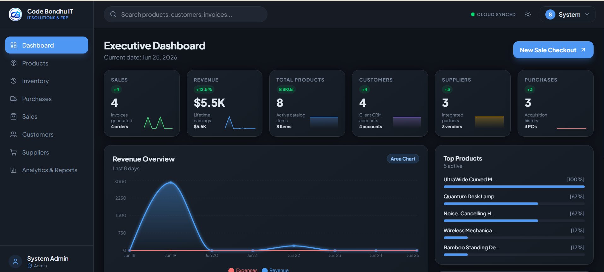
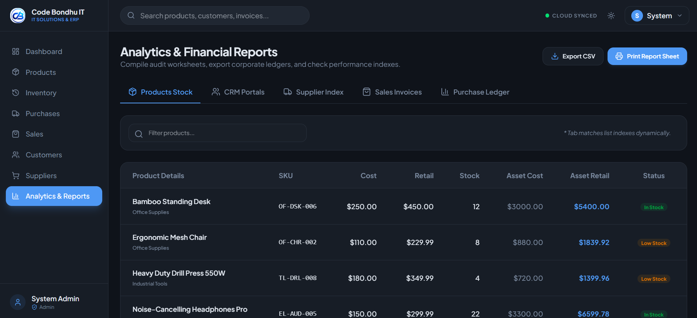

<div align="center">
  

  <h1 align="center">ERP Nexus</h1>

  <p align="center">
    <strong>Premium Enterprise Resource Planning System</strong>
    <br />
    <a href="https://nexuserpsolution.netlify.app/"><strong>Explore the Live Demo »</strong></a>
    <br />
  </p>
</div>

---

## 🌟 Overview

**ERP Nexus** is a premium, production-grade enterprise resource planning (ERP) system designed for scalability, speed, and aesthetics. Built with a modern technology stack, it features a highly resilient architecture with offline-first capabilities.

### 🔗 Live Preview
🌐 **[Nexus ERP Solution - Live Demo](https://nexuserpsolution.netlify.app/)**

<p align="center">
  
</p>

---

## 📐 Architecture & Technology Stack

ERP Nexus utilizes a modern, edge-ready architecture to deliver exceptional performance and an incredible user experience.

### Front-End Core
- **Framework**: React 19 + TypeScript
- **Build Tool**: Vite 8 for lightning-fast HMR and optimized production builds.
- **Routing**: React Router DOM
- **Data Validation**: Zod schema definitions

### Design System & UI/UX
- **Styling Engine**: Tailwind CSS v4
- **Icons**: Lucide React
- **Aesthetics**: Native Dark Mode, Glassmorphism elements, Harmonics HSL color palettes, and seamless micro-animations.

### Backend & Database Resilience Layer
- **Cloud Database**: **Supabase** (PostgreSQL) integrating complex Row-Level Security (RLS) policies and triggers.
- **Offline-First Resilience**: If the Supabase environment is unconfigured or disconnected, the application securely falls back to a **Local Storage Database Engine** with a robust data abstraction layer.

<p align="center">
  
</p>

---

## 🚀 Key Modules & Features

- **📈 Executive Dashboard**: Real-time sales vs. expense analytics charts (Area & Bar), valuation statistics, low stock warnings, and top-selling catalog item widgets.
- **🛡️ Secure Authentication**: Multi-layered sign-in, signup, forgot password, and RLS integration flows.
- **📦 Catalog CRUD Management**: Track inventory items, purchase/selling margins, categories, and custom search filters.
- **👥 CRM Customers & Suppliers Directory**: Track partner contacts, detailed transaction logs, and balances.
- **📥 Purchase Orders (PO)**: Record new acquisitions; stock levels automatically increment, generating audit-friendly ledger history logs.
- **🛒 POS & Checkout Billing**: Add client carts, Flat Tax and Discount computations, and real-time stock validations (prevents checkout if inventory is insufficient).
- **📄 Printable Invoices**: Custom printer-friendly layout structure to export PDF invoice receipts directly from the browser.
- **📊 Date-Filtered Analytics**: Tabular reports of all modules with dynamic date boundaries and CSV export utility.
- **⚡ Search Engine**: Global search bar indexing invoices, clients, vendors, and stock catalogs instantly from any layout.

---

## 🔌 Database Resiliency Layer

ERP Nexus is built with **Offline-First Resilience**:
- A **Connection Badge** in the top navigation bar displays the current database mode (Cloud vs. Local Storage).
- If operating in local fallback mode, the app uses pre-configured sandbox demo accounts:

### Mock Login Accounts (Local Fallback Mode)
- **Admin Privilege (Full Access & Delete Permissions)**:
  - **Email**: `admin@erpnexus.com`
  - **Password**: `admin123`
- **Staff Privilege (Read / Write / Edit; Delete Operations Blocked)**:
  - **Email**: `staff@erpnexus.com`
  - **Password**: `staff123`

---

## 💻 Local Setup & Execution

A portable Node.js v22.13.0 package is included in the project directory to ensure execution regardless of host system setups.

### 1. Launching Local Development Server
Execute the following commands in PowerShell to run the server:
```powershell
# Add the portable Node.js runtime to the PATH
$env:PATH = "D:\jobs\Codebondhu\node-v22.13.0-win-x64;" + $env:PATH

# Start the Vite HMR server
npm run dev
```

### 2. Build for Production
To check type safety and build a minified production package:
```powershell
$env:PATH = "D:\jobs\Codebondhu\node-v22.13.0-win-x64;" + $env:PATH
npm run build
```

---

## 🗄️ Database Schema

The PostgreSQL database schema is available in the root file `supabase_schema.sql`. It defines:
- **Row-Level Security (RLS)** rules.
- **Automated triggers** to synchronize profile details across tables.
- **Relational Tables**: `products`, `customers`, `suppliers`, `purchases`, `sales`, and `stock_movements`.

---

<div align="center">
  <p>Engineered for high-performance and scalability. Built with ❤️</p>
</div>
